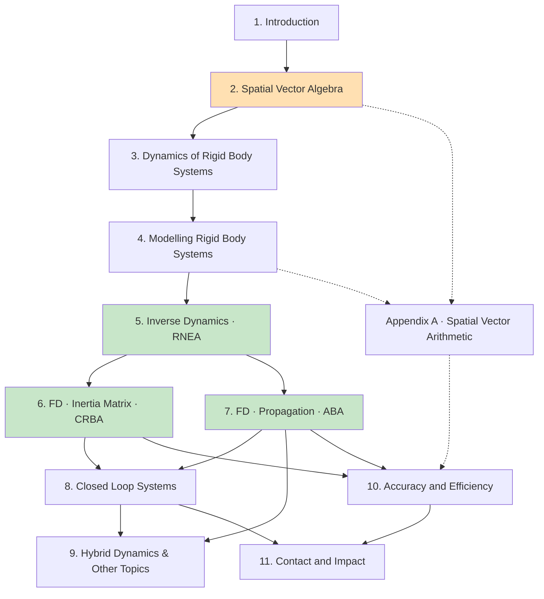

# 全书阅读路线图

> 已按原书目录核对：**正文 11 章 + 附录 A**，共 279 页（含前言、参考文献、符号表、索引）。

## 一、原书自己给的三段划分（§1.4 Readers' Guide）

| 部分 | 章 | 内容 | 原书的话 |
|---|---|---|---|
| **预备 (preparation)** | 2, 3, 4 | 空间向量代数、运动方程的建立与分析、系统模型 | 第 2、3 章是"**最数学的两章**"，且**讲得比后续算法所需的最低限度更深** |
| **主要算法 (main algorithms)** | 5, 6, 7, 8 | RNEA、CRBA、ABA、闭环 | **按复杂度递增排列** |
| **附加专题 (additional topics)** | 9, 10, 11 | 混合动力学与浮动基、精度与效率、接触与碰撞 | 假定掌握前面基础，但**各自相对独立** |

> 💡 **原书还说了一句**：*"Readers with **enough background** may find they can
> **skip straight to Chapter 5**."*

## 二、全书逻辑地图

```
【工具层】  第 2 章  空间向量代数 (pp.7-38)
              M⁶/F⁶ 两个对偶空间，X 与 X*，× 与 ×*，空间惯性，
              f = Ia + v×*Iv
                          ↓
【理论层】  第 3 章  刚体系统动力学 (pp.39-64)
              Hq̈ + C = τ；「两种操作、四种构造方法」——
              后面每一章的算法都是这两种操作的一种排列顺序
                          ↓
【建模层】  第 4 章  刚体系统建模 (pp.65-88)
              连通图 → 生成树 → 正则编号 λ(i)<i → jcalc → 表 4.3 的 model
                          ↓
【算法层】  第 5 章  逆动力学 RNEA          (pp.89-100)   O(n)
            第 6 章  正动力学·惯性矩阵法 CRBA (pp.101-118) O(nd²)
            第 7 章  正动力学·传播法 ABA     (pp.119-140) O(n)
            第 8 章  闭环系统                (pp.141-170) +约束求解
                          ↓
【专题层】  第 9 章  混合动力学、浮动基、齿轮、动力学等价 (pp.171-194)
            第 10 章 精度与效率                          (pp.195-212)
            第 11 章 接触与碰撞                          (pp.213-240)
                          ↓
【实现层】  附录 A  空间向量运算的实现                    (pp.241-256)
```

## 三、章节依赖关系



橙色 = 全书地基；绿色 = 三大核心算法。

## 四、三条阅读路线

### 路线 A：只想会用算法（约 2–3 天）

`第 2 章`（读透）→ `第 4 章`（parent array、jcalc、$S$）
→ `第 5 章`（RNEA）→ `第 7 章`（ABA）

**可跳过**：第 3 章的约束理论、第 6 章的 $LTL$ 分解、第 8–11 章。
**注意**：第 2 章不能跳。

### 路线 B：完整理解（约 3–4 周）

按 1 → 11 顺序读。原书自己的建议：

- **第 2、3 章讲得比后续所需更深**——第一遍读够用即可，回头再深挖
- **第 5–8 章按复杂度递增**，不要跳着读
- **第 9–11 章相对独立**，可以按兴趣挑

**重点投入**：第 2 章约占总时间的 30%（投资回报率最高）。

### 路线 C：为了实现一个物理引擎 / 动力学库

`第 2 章` → `第 4 章`（**完整读**，数据结构照抄表 4.3）
→ `第 5 章` → `第 7 章` → **`第 10 章`**（先看代价表决定实现哪个）
→ `第 6 章`（需要 $H$ 时；$LTL$ 分解在 §6.5）
→ **`第 11 章`**（接触是物理引擎的核心）→ `第 9 章`（浮动基）
→ `第 8 章`（闭链）→ **`附录 A`**（高效实现）

配合本仓库 [`code/`](../code/) 的 Python 实现（与书中伪代码逐行对应）。

## 五、每章读完应该能回答的问题

### 第 1 章
- [ ] FD 与 ID 的定义？ID 除了控制还有什么用途？（提示：它是 FD 的组成部分）
- [ ] 式 1.1 里的 $C$ 是矩阵还是向量？包含重力吗？
- [ ] 什么是"基于模型的算法"？好处是什么？

### 第 2 章（★ 核心）
- [ ] 为什么运动和力要放在两个**不同**的向量空间？导致了哪三个后果？
- [ ] 对偶基的互易条件是什么？正交归一基与它什么关系？
- [ ] 写出 $X$、$X^{*}$、$\hat v\times$、$\hat v\times^{*}$、$I_O$ 的矩阵形式
- [ ] 为什么 $X^{*}=X^{-\mathsf T}$？（代数的和物理的两个理由）
- [ ] 线向量的判据？为什么是 5 个数？§2.5 的两种分解各回答什么问题？
- [ ] 匀速转动刚体的空间加速度是多少？其上一点的经典加速度呢？
- [ ] 式 2.55 的交叉项为什么没有系数 2？那个 2 去哪了？
- [ ] $I=\sum g_ig_i\cdot$ 里 $g_i$ 属于哪个空间？唯一吗？引入它为了做什么？
- [ ] 为什么刚体惯性是 10 个参数而铰接体惯性是 21 个？
- [ ] $\Phi$ 奇异意味着什么？

### 第 3 章
- [ ] §3.2 的**四种构造方法**分别对应后面哪一章的算法？
- [ ] 隐式约束 $K$ 与显式约束 $G$ 的直观含义？为什么 $KG=0$？
- [ ] Jourdain 虚功率原理说什么？它如何给出 $\tau_c=K^{\mathsf T}\lambda$？
- [ ] 为什么"子空间才是物理，矩阵不是"？$S\to SA$ 会改变什么？
- [ ] 为什么不能把 $M^6$ 当欧氏空间求正交补？
- [ ] 关节的**三个**子空间是哪三个？$T_a$ 为什么不唯一？
- [ ] 受约束刚体的三种解法各是什么？$\Phi=S(S^{\mathsf T}IS)^{-1}S^{\mathsf T}$ 与第 7 章什么关系？

### 第 4 章
- [ ] $N_L=N_J-N_B$ 怎么来的？什么是"单弦回路"？
- [ ] 正则编号的六条规则？$\lambda(i)<i$ 让算法省掉了什么？
- [ ] 什么是关节极性？对称关节与非对称关节的区别？表 4.2 在做什么？
- [ ] $\kappa,\mu,\nu$ 的定义？为什么 $j\in\kappa(i)\iff i\in\nu(j)$？
- [ ] $ {}^{i}X_{\lambda(i)}=X_JX_T(i)$ 的两半各代表什么？
- [ ] DH 参数是哪四个？为什么只需 4 个而不是 6 个？适用范围？
- [ ] 球关节为什么 $S$ 变而 $T$ 可以不变？
- [ ] Euler 参数的四条实现负担是什么？

### 第 5 章
- [ ] §5.2：式 5.2 与 5.3 的代价各是多少？为什么差这么多？
- [ ] 非递推算法的复杂度是多少？RNEA 快了多少倍？
- [ ] 重力技巧为什么对？副作用是什么？
- [ ] 式 5.10 用 $\mu(i)$ 写，伪代码却用 $\lambda(i)$——怎么改写的？为什么必须 `+=`？
- [ ] RNEA 除了 $\tau$ 还算出了什么？有什么用？
- [ ] §5.4：3D 版本与空间版本**唯一的实质差别**是什么？

### 第 6 章
- [ ] $H_{ij}\ne0$ 的充要条件？式 6.14 的下标条件怎么记（提示：式 6.16 的 $\max$）？
- [ ] 推导 $H_{ij}=\sum_{k\in\nu(i)\cap\nu(j)}(\cdots)$ 的五步
- [ ] §6.3 导致 CRBA 被发现的**两个关键事实**是什么？
- [ ] 密度 $\rho$ 的经验法则？为什么分支让惯性矩阵法**更快**？
- [ ] 为什么用 $L^{\mathsf T}L$ 而不是 $LL^{\mathsf T}$？"无填充"是什么意思？
- [ ] $\mathrm{ID}_\delta$（表 6.1）与完整 RNEA 差在哪三处？

### 第 7 章
- [ ] $I^A$ 与 $I$ 的**关键差别**是什么？为什么 $\tfrac12v^{\mathsf T}I^Av$ 无意义？
- [ ] 例 7.1 的盒子在哪个方向"显得更轻"？为什么？
- [ ] 投影法给出的 $I^A=(JH^{-1}J^{\mathsf T})^{-1}$ 有什么别名？
- [ ] 式 7.25 说 $I^A$ 与 $I^a$ 的区别是什么？
- [ ] 为什么必须三趟？ABA 比 RNEA 多的那一趟在做什么？
- [ ] §7.4 的复合矩阵怎么组装？为什么说 ABA 就是高斯消元？

### 第 8 章
- [ ] $\tau^a$ 是什么？什么时候为零？
- [ ] $\epsilon_{lj}$ 的符号怎么定？"回路的根"是什么？
- [ ] Baumgarte 的 $T_{stab}$ 怎么选？为什么"越小越好"是错的？
- [ ] 三种求解方法各是什么？方法 2 为什么不显式求 $H^{-1}$？
- [ ] 自由度 = ？什么是可变自由度、位形歧义、过约束？
- [ ] 为什么"含平面回路的系统一定过约束"？怎么转化？
- [ ] 闭环系统的逆动力学有几个解？欠驱动/冗余驱动/恰驱动怎么定义？

### 第 9 章
- [ ] 混合动力学最被低估的用途是什么？
- [ ] $C'$ 的物理含义？怎么用一次 ID 调用算出？
- [ ] §9.2：FD 关节和 ID 关节的处理有什么本质区别（消元 vs 代入）？
- [ ] 浮动基取 $S_1=\mathbf 1$ 后，$\dot q_1,\ddot q_1,\tau_1$ 分别是什么？
- [ ] 为什么**不该**构造 $H^{fl}=H-F^{\mathsf T}(I^c_0)^{-1}F$？
- [ ] 例 9.3 的动量表达式是什么？
- [ ] 原书怎么处理齿轮？和"加 $\rho^2I_{rotor}$"有什么区别？
- [ ] 为什么惯性参数无法从动力学行为辨识？

### 第 10 章
- [ ] 舍入误差的四个诱因？"远坐标系"的判据是什么？
- [ ] $\kappa(H)$ 最坏怎么增长？这对长链仿真意味着什么？
- [ ] 为什么应该选**深度最小**的生成树？（两个理由）
- [ ] ABA 与 $O(n^3)$ 路线的交叉点在 $n=$？
- [ ] $O(n^3)$ 路线里哪一项主导？想优化该优化谁？
- [ ] CRBA 的**真实**复杂度是什么？"$O(n^3)$ 算法"这名字为什么有误导性？
- [ ] 符号化简的四条规则？两个潜在缺点？

### 第 11 章
- [ ] 为什么"有限力 ⟹ $\zeta=0$"？$\zeta\ne0$ 意味着什么？
- [ ] 互补条件的三个式子各说什么？
- [ ] 为什么加速度只是施加力的**分段线性**函数？后果是什么？
- [ ] 例 11.1 为什么可能无解？物理引擎为什么必须容忍穿透？
- [ ] 图 11.4 的四个状态？§11.1–11.3 讲的是哪一个？
- [ ] LCP 与 QP 什么关系？为什么实践中多用 QP？
- [ ] 表 11.1 的核心思想是什么？为什么不用每步都解 LCP？
- [ ] 为什么多面体不适合做动力学？
- [ ] 软接触的三个实现优势？主要缺点？

## 六、常见的"读不下去"及对策

| 症状 | 原因 | 对策 |
|---|---|---|
| 第 2 章看不进去 | 缺少动机 | 先跳读第 5 章 RNEA 的伪代码，看它有多短，再回来 |
| 上下标彻底晕了 | 符号密度极高 | 用 [`reference/notation.md`](../reference/notation.md)；每写一个式子都标出它属于 $M^6$ 还是 $F^6$ |
| 第 3 章觉得没用 | 它是抽象框架 | 快速过一遍，读完第 5–7 章后**重读**（原书自己也说这两章讲得比所需更深） |
| ABA 推导看不懂 | 铰接体惯性的归纳推导确实绕 | 先接受结论、把伪代码跑通；再看 §7.4 的高斯消元视角 |
| 不知道有没有读懂 | 缺少反馈 | 用第五节的自测题；或直接实现算法，用 RNEA↔ABA 互验 |
| 第 8 章太长 | 13 节确实多 | 先读 §8.1、8.2、8.5、8.10，其余按需 |

**互验技巧**：ABA 算出 $\ddot q$ 后喂给 RNEA，应得回原来的 $\tau$。
两算法完全独立，几乎不可能同时错成一致。
本仓库 [`code/verify_all.py`](../code/verify_all.py) 实现了这一套对拍。
