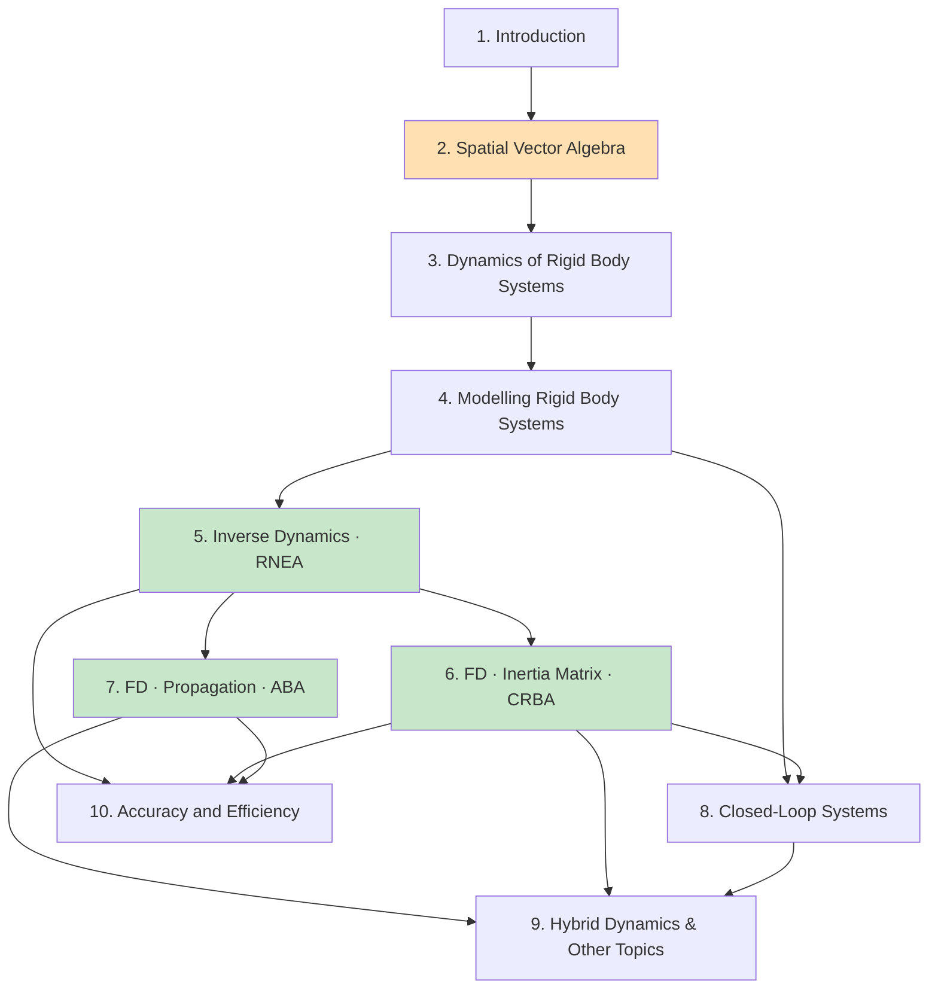

# 全书阅读路线图

## 一、全书逻辑地图

这本书的组织方式非常清晰，可以概括成四段：

```
【工具层】  第 2 章  空间向量代数
              把 3D 的 (力矩, 力) 和 (角速度, 线速度) 打包成 6D 向量，
              建立 M⁶ / F⁶ 两个对偶空间上的完整代数。
                          ↓
【理论层】  第 3 章  刚体系统动力学
              用空间向量写出系统的运动方程 H q̈ + C = τ，
              把"关节"抽象成运动子空间 S 与约束力子空间 T。
                          ↓
【建模层】  第 4 章  刚体系统建模
              连通图 → 生成树 → parent array λ(i)、关节模型 jcalc、
              坐标变换 X_T(i)。这一章决定了后面所有算法的数据结构。
                          ↓
【算法层】  第 5 章  逆动力学          RNEA      O(n)
            第 6 章  正动力学·惯性矩阵法 CRBA      O(n²)
            第 7 章  正动力学·传播法    ABA       O(n)
            第 8 章  闭环系统           +约束求解
            第 9 章  混合动力学、浮动基、碰撞
            第 10 章 精度与效率（代价对比、数值问题）
```

## 二、章节依赖关系



橙色 = 全书地基；绿色 = 三大核心算法。

## 三、三条阅读路线

### 路线 A：只想会用算法（约 2–3 天）

> 目标：能在自己的代码里正确调用/实现 RNEA 和 ABA。

`第 2 章`（读透，尤其 §空间加速度、坐标变换、空间惯性）
→ `第 4 章`（只读 parent array、jcalc、S 矩阵）
→ `第 5 章`（RNEA 全读）
→ `第 7 章`（ABA 全读）

**可跳过**：第 3 章的约束理论、第 6 章的 LTL 分解、第 8/9 章。
**注意**：第 2 章不能跳。跳了它读第 5 章会全程不知道 $\mathbf{v} \times^* I \mathbf{v}$ 是什么。

### 路线 B：完整理解（约 2–3 周）

按 1 → 10 顺序读。重点投入：

- **第 2 章花掉总时间的 30%**——这是投资回报率最高的一章；
- 第 3 章偏抽象，第一遍可以读快一点，读完第 5–7 章后回头再读会通透很多；
- 第 6 章的 H 稀疏性与 LTL 分解是很多人跳过的部分，但它是高效实现的关键；
- 第 8 章闭环如果暂时用不到，可以推迟。

### 路线 C：为了实现一个物理引擎 / 动力学库

`第 2 章` → `第 4 章`（**完整读**，数据结构照抄）→ `第 5 章` → `第 7 章`
→ `第 10 章`（先看代价表决定实现哪个）→ `第 6 章`（需要 H 时）
→ `第 9 章`（浮动基、接触）→ `第 8 章`（闭链）

配合作者的 `spatial_v2` MATLAB 工具箱对照着写，能省掉大量调试时间。

## 四、每章读完应该能回答的问题

自测清单——如果答不上来，说明这一章没读透。

### 第 2 章 空间向量代数
- [ ] 为什么运动和力要放在两个**不同**的向量空间？它们之间的关系是什么？
- [ ] 空间加速度 $\mathbf{a}$ 和某个物质点的经典加速度有什么区别？为什么前者更好用？
- [ ] $X$ 和 $X^*$ 是什么关系？为什么力向量的变换矩阵不是 $X$ 本身？
- [ ] $\mathbf{v} \times$ 和 $\mathbf{v} \times^*$ 为什么是两个不同的算子？
- [ ] 刚体运动方程 $\mathbf{f} = I\mathbf{a} + \mathbf{v} \times^* I \mathbf{v}$ 里第二项的物理意义是什么？

### 第 3 章 刚体系统动力学
- [ ] $H(q)$ 有哪些数学性质？为什么它一定是对称正定的？
- [ ] 运动子空间 $S$ 和约束力子空间 $T$ 为什么是互补的？
- [ ] 为什么关节的驱动力可以写成 $\tau = S^{\mathsf T}\mathbf{f}$？

### 第 4 章 建模
- [ ] 正则编号规则 $\lambda(i) < i$ 为什么重要？它让算法省掉了什么？
- [ ] `jcalc` 返回哪三样东西？各自的作用？
- [ ] $X_T(i)$ 和 $X_J(i)$ 的分工是什么？为什么要拆成两个？

### 第 5 章 RNEA
- [ ] "重力技巧"（令 $\mathbf{a}_0 = -\mathbf{a}_g$）为什么是对的？
- [ ] 外推那一趟在算什么？内推那一趟在算什么？
- [ ] 怎么用 RNEA 求偏置力 $C$？怎么用它逐列求出 $H$？

### 第 6 章 CRBA
- [ ] 复合刚体惯性 $I^c_i$ 的物理含义是什么？
- [ ] $H_{ij} \ne 0$ 的充要条件是什么？（提示：跟树的祖先关系有关）
- [ ] 为什么用 LTL 分解而不是普通 Cholesky？

### 第 7 章 ABA
- [ ] 铰接体惯性 (articulated-body inertia) 和刚体惯性的本质区别是什么？
- [ ] 为什么 $\mathbf{f} = I^A \mathbf{a} + \mathbf{p}^A$ 里必须有偏置项 $\mathbf{p}^A$？
- [ ] ABA 三趟各自在做什么？为什么必须是三趟而不是两趟？

### 第 8 章 闭环
- [ ] 闭环约束是怎么转化成生成树 + 约束方程的？
- [ ] 约束漂移 (constraint drift) 从哪来？Baumgarte 稳定化的原理？

### 第 9 章 混合动力学
- [ ] 混合动力学问题和 FD / ID 的关系是什么？
- [ ] 浮动基座为什么可以直接当成一个 6-DoF 关节处理？

### 第 10 章 精度与效率
- [ ] ABA 和 CRBA+求解 的代价交叉点大概在 $n$ 多大的时候？
- [ ] 什么情况下 $O(n^2)$ 的 CRBA 反而比 $O(n)$ 的 ABA 快？

## 五、常见的"读不下去"及对策

| 症状 | 原因 | 对策 |
|---|---|---|
| 第 2 章看不进去，觉得太抽象 | 缺少动机，不知道 6D 向量好在哪 | 先跳读第 5 章 RNEA 的伪代码，看它有多短，再回来读第 2 章 |
| 公式里的上下标彻底晕了 | 本书符号密度极高 | 用 `reference/notation.md`，并强制自己每写一个式子都标出它属于 $M^6$ 还是 $F^6$ |
| 第 3 章觉得没用 | 它是抽象框架，回报在后面 | 快速过一遍，读完第 5–7 章后重读 |
| ABA 的推导看不懂 | 铰接体惯性的归纳推导确实绕 | 先接受结论、把伪代码跑通，再回头看推导 |
| 不知道自己有没有读懂 | 缺少反馈 | 用第四节的自测问题；或者直接实现算法，用 RNEA 和 ABA 互验（见下） |

**互验技巧**：ABA 算出 $\ddot q$ 后，把 $(q, \dot q, \ddot q)$ 喂给 RNEA，应该得回原来的 $\tau$。
这是检验实现正确性最有效的一招，两个算法完全独立，几乎不可能同时错成一致。
